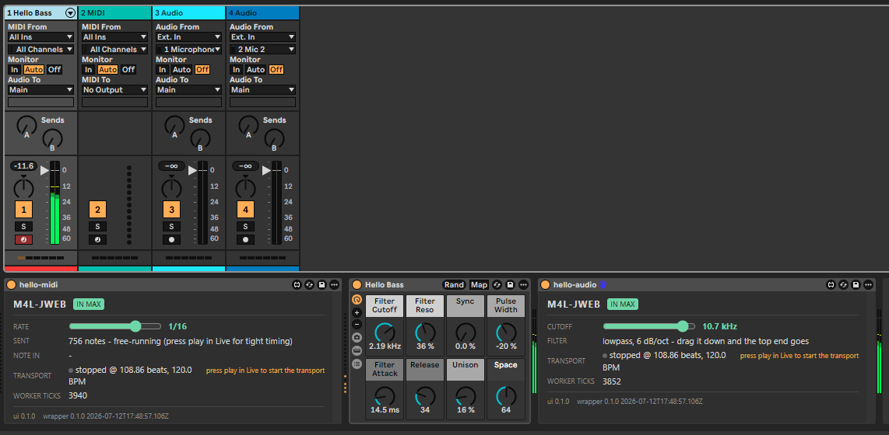

# M4L-JWEB

**Build Ableton Live devices like a web developer.**

M4L-JWEB lets you author Ableton Live Max for Live devices (`.amxd`) in an
ordinary TypeScript repo, with the tools any developer already expects: a package
manager, a typechecker, unit tests, CI. The device UI is a React app, and it can
be run, simulated and tested **outside Ableton and outside Max** - against a
mocked Live, in a browser.

The glue that a device needs is provided rather than rewritten each time: the
message bridge between the browser and Max, the `[js]` script that talks to
Live's object model, the generated patcher, and the binary `.amxd` writer. So
`pnpm build` produces installable devices on a machine that has never had Max on
it, which means CI can ship them.

```bash
pnpm install
pnpm dev:hello-midi   # the device in a browser, with a mocked Live beside it
pnpm build            # .amxd files, no Max installed
pnpm install:device   # into Ableton's User Library
```

The repo builds two devices out of the box, and they are the examples:

| Device | Type | What it is |
|---|---|---|
| **hello-midi** | MIDI effect | A pulse generator. A Rate slider (off, 1/4, 1/8, 1/16, 1/32) plays C3 on every division, placed on Max's scheduler. |
| **hello-audio** | audio effect | A lowpass filter. A Cutoff slider in the device window drives a real filter in the signal path. |

Each lives in its own folder under `src/app/`, and each builds into its own
`.amxd` carrying its own UI bundle.

### Both of them, in a real chain



**hello-midi** (left, a MIDI effect) is pulsing C3 at 1/16. It feeds **Hello
Bass** - an ordinary Ableton instrument, nothing to do with this repo - which
turns those notes into audio. That audio then runs through **hello-audio**
(right, an audio effect), whose Cutoff slider is riding a real lowpass filter at
10.7 kHz.

Two devices built from TypeScript, sitting in a normal Live device chain either
side of a stock instrument, behaving like any other device. Note that hello-midi
says *"free-running"*: the transport is stopped, so it is pulsing off its own
fallback clock rather than Live's - see the tutorial for why a sequencer must use
the transport when it is running.

For how any of it works underneath - the message protocol, the generated
patchers, the `.amxd` container writer, Push support - see
**[doc/ARCHITECTURE.md](doc/ARCHITECTURE.md)**.

---

## What you need

### To build

- **Node.js 20+** and **pnpm 10+**.
- **No Max license, and no Max editor.** The patcher is generated, and the
  container is written byte-for-byte by `packages/build/src/amxd.mjs`.
- **No Ableton Live.** The entire UI develops in a browser, against a mocked Live.

### To run the device: Live, and not every edition

**Not every Ableton edition can run Max for Live devices:**

| Edition | Runs this device? |
|---|---|
| **Live Suite** | Yes. Max for Live is included. This is the normal path. |
| **Live Standard** | Only with the paid **Max for Live add-on**. Not included by default. |
| **Live Intro** | No. Max for Live is not available, and there is no add-on path. |
| **Live Lite** (bundled with hardware) | No. Same as Intro. |

So **the entry-level Ableton license cannot run this.** You need Suite, or
Standard plus the Max for Live add-on. You do **not** need a separate Cycling '74
Max license on top - Max for Live bundles the Max runtime, and this repo never
opens the Max editor anyway.

**Versions.** Developed and tested against **Live 12 with Max 9** on Windows. The
`[jweb]` object the whole UI depends on arrived in **Max 8**, so Live 10 and 11
should work in principle - but that is reasoning from the docs, not something I
have run. Treat anything below Live 12 as unverified.

**Platforms.** Live runs on **macOS and Windows** only. The build runs anywhere
Node does, so CI on Linux is fine - you just cannot run the result there.

---

## Build, run, install

### Develop without Live

```bash
pnpm dev:hello-midi     # or dev:hello-audio, or dev:spike
```

A **mocked Live** renders beside your device: a transport (play/stop, BPM)
driving real `tick` and `tempo` messages at the same 20 Hz cadence the wrapper
polls Live at, and a **log of every message crossing the bridge**, in both
directions. A sequencer becomes developable, and debuggable, in a browser tab.

The device keeps its true **169 px** height there, deliberately: the Live device
view does not scroll, it silently clips, and that is the cheapest bug to catch
early.

**A mock is a mock.** It gives you the entire message-level contract without a
DAW - the tedious, easy-to-get-wrong part. It cannot tell you about MIDI jitter,
real DSP, or LiveAPI on a loaded set. Keep "load it in Live" for those.

### Build and test

```bash
pnpm build   # one UI bundle per device, then one .amxd per device
pnpm test    # container round-trip, ES5 gate, protocol lint, bundle separation
```

### Install into Live

```bash
pnpm install:device
```

That picks the right script for your platform, finds your User Library, and
replaces any previous install of this device folder:

```
  installed hello-midi.amxd
  installed hello-audio.amxd
Installed to <User Library>\Max For Live\m4l-jweb
```

Then in Live: **User Library > Max For Live > m4l-jweb**.

> **The one gotcha:** Live embeds a **copy** of a device into the set. Instances
> already sitting on a track will **not** update when you reinstall - delete them
> and re-drag from the browser. Every device prints a build stamp in its footer,
> so a stale one is visible rather than mysterious.

The User Library is read from Live's own preferences (`Library.cfg`, the
`ProjectPath` value), newest version first, falling back to Live's default
location. No registry keys and no environment variables are involved, so a custom
library location is picked up automatically.

`pnpm install:device` wraps the same per-platform scripts the build copies into
`dist/` and into the release zip, so you can run them yourself
(`dist\install-windows.ps1`, `dist/install-mac.sh`). Both accept an optional
device name and source folder, which is how the CLI drives them - someone who
receives only the release zip runs the script sitting next to the device folder,
with no repo and no Node. There is no Linux installer: Live has no Linux build.

---

## Why: what Max for Live development normally costs

Ableton has no public plugin SDK for its device area. What it has is **Max for
Live**: an embedding of Cycling '74's Max, a visual programming environment with
four decades of history. A device is a Max *patcher* - a graph of boxes connected
by patch cords - wrapped in a binary `.amxd` container and hosted in Live's
device chain.

The canonical workflow:

1. Open Live, drop a Max device on a track, click Edit. The Max editor opens.
2. Drag objects onto a canvas: `midiin`, `live.dial`, `[js]`, MSP signal objects.
   Draw cords between them. Position everything by pixel.
3. For anything algorithmic, write ES5 JavaScript inside the `[js]` object, which
   also carries **LiveAPI** - the only scriptable access to Live's object model
   (tracks, clips, scenes, transport, scale).
4. Save. "Freeze" the device so its file dependencies travel inside the `.amxd`.
   Distribute that file.

This workflow has real strengths: it is direct, live-editable, and the Max object
library is enormous. Thousands of excellent devices are built this way. **None of
this is a criticism of Max** - it was designed for musicians patching live, and it
excels at that. It just means a software engineer's entire toolbox sits unused:

| What is missing | What M4L-JWEB does instead |
|---|---|
| **No components, no CSS, no state management.** The UI toolkit is Max's own, positioned visually and styled sparsely. | **The UI is a React app**, running in the `[jweb]` Chromium view that ships with Max. Components, CSS, canvas, WebGL, Web Workers. |
| **No modern language.** `[js]` runs an ES5-era interpreter: no modules, no `let`/`const`, no promises, no npm. | **You write TypeScript**, everywhere, including the `[js]` glue. ES5 is a compiler target, not a way of life - and the build re-parses the emitted glue to *prove* it is ES5 before it will package. |
| **No build, no diff, no CI.** The patcher is both source and artifact; version control sees JSON full of pixel coordinates; producing a distributable needs a human clicking inside a licensed Max editor. | **Patchers are generated from a manifest**, so patch cords become code review, and `pnpm build` emits `.amxd` files on a runner that has never had Max on it. |
| **A virtual filesystem quirk.** Frozen dependencies live inside the device where only Max-native objects can read them - an embedded browser cannot open the files you shipped with your own device. | **The UI travels inside the device** as a payload the `[js]` wrapper extracts to a real file on load, then points `[jweb]` at. |

The result is an Ableton device you build the way you build anything else: edit
text, run tests, push, let CI produce the artifact. No editor in the loop, no
pixel coordinates in your diffs.

**What it does not change.** Push still sees only Live *parameters*, never your
UI. Audio still belongs to Max's signal path, not to your app. Timing still
belongs to Max's scheduler. M4L-JWEB moves the *authoring*, not the runtime - and
the tutorial below is mostly about respecting that line.

It also makes the repo unusually agent-friendly, for the same reason: every
artifact is text, and every invariant is enforced by the build (ES5 gate,
container round-trip, protocol lint, bundle separation), so an LLM can implement a
device end to end and verify its own work. `CLAUDE.md` spells out the guardrails.

---

## Tutorial: define a device

### 1. Declare the device - `patcher/devices.mjs`

The manifest says what the device *is*. The patcher is generated from it, so
patch cords become something you review rather than something you drag.

```js
export default [
  {
    name: "my-device",
    type: "midi",                    // midi | audio | instrument
    chains: ["midiin", "midiout"],   // canned wiring, applied in order
    parameters: [                    // real Live parameters - see step 4
      { id: "density", object: "live.dial", range: [0, 1], default: 0.5 },
    ],
    unmatchedTo: "js",
  },
];
```

A **chain** is a small function that adds boxes and cords. Shipped today:

| Chain | What you get |
|---|---|
| `midiin` | Notes played into the device arrive in your app. |
| `midiout` | Notes your app generates are placed by Max, with sample-accurate timing. |
| `lowpass` | An audio effect you can hear: a filter with a Cutoff parameter. |
| `gain` | An audio effect with a Live parameter on the level. |
| `passthrough` | A straight wire. It does *nothing* to the audio - a scaffold, not a feature. |

Write your own in `patcher/chains.mjs`. And set `default` on every parameter:
without it a `live.dial` loads at the *bottom* of its range, and for a filter
cutoff that is a device which swallows the signal the moment you drop it on a
track.

### 2. Define the protocol - `src/app/<device>/protocol.ts`

Every message crossing the bridge is a **selector** (a word) followed by
arguments. This file is the single source of truth for both sides, and `pnpm
test` fails if you name a selector nothing on the Max side handles - because an
unrouted selector produces no error at runtime, it just falls on the floor.

Spread in the library's contracts rather than retyping the names. `DEVICE_IN` is
what the wrapper sends every device; `CHAIN_IN`/`CHAIN_OUT` are what the chains
own.

```ts
import { CHAIN_IN, CHAIN_OUT, DEVICE_IN } from "@m4l-jweb/bridge";

export const IN = {
  ...DEVICE_IN,         // mode, build, tick, tempo
  ...CHAIN_IN,          // notein <pitch> <velocity>
  density: "density",   // a parameter is just another message
} as const;

export const OUT = {
  ...CHAIN_OUT,         // midinote ..., flush
  ui_ready: "ui_ready",
} as const;
```

### 3. Write the device - `src/app/<device>/App.tsx`

It is a React app. The only thing that makes it a *device* is the bridge.

```tsx
import { flushNotes, onNote, sendNote } from "@m4l-jweb/bridge";
import { useDevice } from "../shared/device";

// mode, build stamp, tempo, transport - and the `ui_ready` handshake, which is
// not optional: the page loads asynchronously, so anything the wrapper sent
// before your handlers existed is simply gone.
const device = useDevice((playing, beats) => {
  // Called on every transport poll. Send your notes from in here.
});

// Notes played INTO the device. Note-offs are filtered - Max owns the release.
onNote((pitch, velocity) => { /* ... */ });

// Notes OUT of it. You compute WHEN; Max places the note on its scheduler.
sendNote({ pitch: 60, velocity: 100, durationMs: 120, delayMs: 80 });

// Notes are HELD by Max. A device that just stops sending leaves them sounding.
flushNotes();
```

**`delayMs` is the whole point of the split.** Live's transport reaches you at
20 Hz, so each tick covers a *slice* of musical time rather than an instant - and
a note almost never falls exactly on a poll. Work out which notes land inside the
slice, send each one with the delay that carries it to its true position, and Max
places them precisely. The notes land tight even though the clock driving them is
coarse, and your app never touches a timer.

**Audio is not yours to carry.** An audio effect's parameter is wired straight
into the signal path inside the patcher: your React code moves a *value*, never a
sample, and the sound keeps working even if the browser stalls.

### 4. Add parameters - `parameters`

Parameters in the manifest become Live parameters: automatable, MIDI-mappable,
and readable by Push. Each one also arrives in your app as a message
(`density 0.42`).

Push shows parameters, not your UI, so a control has to exist in both places.
Declaring them once - in `src/app/<device>/surface.ts` - and generating the rest
is planned but not built yet; for now the manifest is what Live reads. See
[doc/SURFACE.md](doc/SURFACE.md) for the design and [doc/TODO.md](doc/TODO.md)
for the plan.

### 5. One device, one bundle

Each device is a folder under `src/app/`, and each `.amxd` embeds **its own** UI
bundle: `hello-midi` carries no filter code, `hello-audio` carries no sequencer.
`pnpm dev:<device>` runs one of them; `pnpm build` bundles each in turn. A device
ships what it is, not what its siblings are.

---

## Starting a new device from scratch

`m4l-jweb init` scaffolds a fresh device repo, with `@m4l-jweb/bridge` and
`@m4l-jweb/build` as real published dependencies rather than workspace links:

```bash
pnpm dlx @m4l-jweb/build init my-device
cd my-device && pnpm install
pnpm dev
```

The template lives inside `@m4l-jweb/build` at
`packages/build/templates/starter/` rather than in a separate scaffolding repo,
precisely so it cannot drift from what the library actually needs: when a build
option or wrapper convention changes here, the template changes in the same
commit.

---

## License

MIT.
