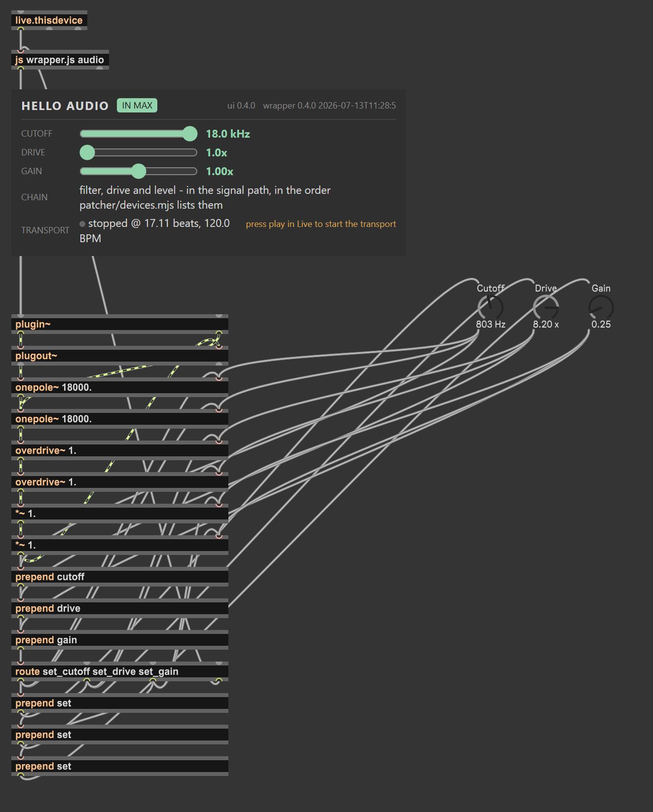

# M4L-JWEB: architecture

**Read the [README](../README.md) first.** It covers what this is, what it costs
you to build and run, why Max for Live development normally hurts, and a tutorial
for defining a device. This document is the part after *"yes, but how"* - it
assumes all of that and does not repeat it.

---

## The idea

**Building a Max for Live device normally means clicking around a UI - dragging objects,
drawing cords. To a developer that feels unnatural.** And it is not just aesthetics;
a patcher you assemble by hand is a binary you cannot diff, cannot review
 cannot generate and cannot test. The "source" of a device is a picture of it.

M4L-JWEB allows to author Max for Live patches and devices using *declarative Typescript*.

The generated devices have most of the features that you would expect of a M4L device,
including macros and automation over the exposed controls, surface control mapping (ie: Ableton Push 3 compatible),
modulation between controls, etc. All via code.

This enables version control, code review, CI, refactoring by rename, and generally speaking
better software development practices. And, by being code, an LLM can assist you in creating and refactoring, just as it would with
any other programming language.

## How is it possible?

Max ships two mechanisms that, together, cover almost everything a device needs.

- **`[jweb~]`** is a full Chromium browser view embedded in the device. It runs
  anything the web runs: React, canvas, WebAssembly, Web Workers - and its two SIGNAL
  outlets carry the page's Web Audio output straight into Max's audio graph, which is
  what lets a device's sound be a web page's sound. (The plain `[jweb]`, message
  outlets only, is what this library was built on until 0.9.9.)
- **`[js]`** is old, but it holds LiveAPI, and it always runs - even inside a
  frozen device.

So the architecture splits a device into three layers, each written as ordinary
text in an ordinary repo:

```
        your repo (TypeScript, JSON, scripts - all reviewable)
  +----------------------------------------------------+
  |  UI + logic:  web app (+ optional Web Worker)       |
  |  Live glue:   wrapper script for [js] (LiveAPI)     |
  |  Structure:   patcher template + device manifest    |
  +-------------------+--------------------------------+
                      |  one build command (no Max, CI-friendly)
                      v
              installable .amxd file(s)
```

Five patterns make it work.

**1. The UI is a web app.** One page, bundled into a single self-contained html
file (every script, style and asset inlined). jweb exposes a two-call bridge to
the page: `window.max.bindInlet(name, handler)` to receive Max messages,
`window.max.outlet(...)` to send them. That is the entire API surface between
your app and the device.
Outside Max, a dev shim simulates the bridge so you
develop in a normal browser with hot reload. See `@m4l-jweb/bridge`.

**2. Heavy logic runs in a Web Worker.** Sequencers, analyzers, anything that
must not fight the UI thread. Dedicated workers are also exempt from the timer
throttling Chromium applies to hidden pages - relevant, because your device's
view is often not visible. Design message-driven (Live pushes time in, you push
events out) and you barely depend on timers at all. See `src/app/shared/worker.ts`.

**3. The `[js]` glue stays thin - and you write it in TypeScript.** One file
(`wrapper/wrapper.ts`) owns everything that needs LiveAPI: reading and writing
clips, observing properties, polling transport. It compiles with `tsc` targeting
ES5, and the build refuses to package it if the output does not parse as ES5.
The constraints that remain are runtime, not syntax: no `setTimeout` (use Max's `Task`),
no `console` (use `post()`), no module system (bundle to one file),
and a handful of LiveAPI lifecycle rules covered below.

**4. Patchers are generated, not drawn.** A patcher is just JSON: `boxes`
(objects, e.g. `"route noteevent stop"`) and `lines` (cords, e.g. source
box/outlet to destination box/inlet). M4L-JWEB keeps a minimal hand-made
template (`patcher/base.json`) and generates each device variant from a
declarative manifest (`patcher/devices.mjs`) - device type, chains, routing -
via `box()`/`line()` helpers. Patch cords become code review.

**5. The `.amxd` container is written headless.** The container format is
undocumented but simple, reverse-engineered from devices saved by Max 8/9: a
header carrying the device-type tag, a chunk with the patcher JSON and each
embedded dependency, and a directory of name/size/offset entries. About 150
lines of Buffer code write it byte-for-byte (`packages/build/src/amxd.mjs`). This is
the piece that removes Max from the loop entirely: `pnpm build` on a CI runner
emits installable devices.

One supporting trick holds it together: **self-extracting payloads**. Because
Chromium cannot read Max's frozen virtual filesystem, the build appends the UI
html to the wrapper script as base64. On first load the wrapper - which always
runs - writes the real file next to the `.amxd`, stamps it with the build id,
and points jweb at a cache-busted `file://` URL. A couple of extra tricks ensure mixed installs
are structurally impossible: the UI and the wrapper each display their build stamp
and complain on mismatch.

## Talking to Live: the protocol

Everything between the layers crosses as **Max messages**: a selector word
followed by arguments (`noteevent 60 96 480 1 35`), with three aditional safety measures:

1. **Selectors are your routing table.** `[route sel1 sel2]` dispatches by first
   word; unmatched messages fall out of the last outlet toward the next
   consumer. One jweb outlet can feed an output chain and the LiveAPI glue at
   once.
2. **Base64 anything structured.** Max splits messages on commas and semicolons;
   encode code, JSON and paths.
3. **Handshake, never assume order.** The page loads asynchronously. Have the UI
   announce `ui_ready`; have the wrapper reply with current state (mode,
   parameters, tempo). Anything that boots late gets the same treatment.

Keep every selector in that device's `src/app/<device>/protocol.ts` so both sides
agree and CI can lint them.

### The library owns the chains' selectors

A chain in `@m4l-jweb/build` is library code - but for a long time the names for
*addressing* one were not. Every device retyped `midinote` and `notein` in its
own `protocol.ts`, and a typo produced no error anywhere: just a note that never
sounded.

So the chain contract lives in the library too. `@m4l-jweb/bridge` exports
`CHAIN_IN` and `CHAIN_OUT` - the selectors the packaged chains own - and a
device spreads them in rather than retyping them:

```ts
import { CHAIN_IN, CHAIN_OUT } from "@m4l-jweb/bridge";

export const IN  = { ...CHAIN_IN,  mode: "mode", build: "build" } as const;
export const OUT = { ...CHAIN_OUT, ui_ready: "ui_ready" } as const;
```

The name you send and the name the generated `[route]` matches now come from one
definition. On top of them sit the typed helpers - `sendNote({ pitch, velocity,
durationMs, delayMs })`, `onNote(cb)`, `flushNotes()` - because
`outlet("midinote", 60, 100, 250, 1, 0)` is five positional ints that are easy
to get subtly wrong and silent when you do.

`flushNotes()` is not an afterthought: notes are *held* by `[makenote]` on the
Max side, so a UI that stops sending without flushing leaves them sounding
forever.

### The bridge is the only channel

There is exactly one path between the two halves of a device. That makes it the
one place worth observing: `tapMessages(fn)` sees every message crossing it, in
both directions, which is the device's entire contract, live. The dev harness
below renders it as a log; in a real device you can bind a tap from the Chromium
console.

### The lint reads the device's own Max side too

`tests/protocol.test.mjs` checks that every selector is sent, handled or routed
somewhere on the Max side. "The Max side" is four things, and a lint that reads
only some of them quietly stops checking: the packaged wrapper, the packaged
chains, **this repo's own** `patcher/chains.mjs` and `wrapper/device.ts`, and -
above all - the **generated patchers**, which are what actually ships.

Parameters get the same lint, from `surface.ts` rather than from `protocol.ts`. A
parameter is two selectors (`<id>` out of the object, `set_<id>` back into it) and
the patcher must carry **both**: one without the other is a control that reads but
cannot be moved, or moves but never reports, and neither raises an error. The lint
also fails if a parameter is *re-declared by hand* in `protocol.ts` - two sources
of truth for one string is the drift the Surface exists to delete.

### Reading from Live (events in)

| You want | The M4L-JWEB way |
|---|---|
| Transport position and play state | Poll `live_set is_playing` + `current_song_time` from the wrapper on a 50 ms `Task`; emit `tick <playing> <beats>`. Prefer LiveAPI polling over `plugsync~` signal chains: MIDI-effect devices do not reliably run a DSP graph, and LiveAPI works in every device type. |
| Tempo | A LiveAPI property observer on `live_set tempo` (the signal-domain alternative reports samples-per-beat, not BPM). |
| Any observable property (scale, track name, selected scene...) | `new LiveAPI(callback, "live_set")` + `.property = "..."`; the callback fires on attach and on every change. Forward to the UI as a message. |
| Things with no observer | Poll with a `Task` and push a message only on change. |
| Device lifecycle | `live.thisdevice` fires a bang when the device is fully loaded. Do all LiveAPI bootstrapping there, never in `loadbang` (see `CLAUDE.md`). |

### Acting on Live (events out)

| You want | The M4L-JWEB way |
|---|---|
| Emit live MIDI | Message chain in the patcher: `route` -> `unpack` -> `pipe` (per-note delay for precise timing) -> `makenote` (automatic note-offs) -> `midiformat` -> `midiout`. Compute *when* in your app; let Max place it precisely. This is the `midiout` chain. |
| Create or read MIDI clips | LiveAPI from the wrapper: `clip_slots`, `create_clip`, `add_new_notes`, `get_notes_extended`. |
| Synthesize sound | Instrument device: message-driven `poly~` voices. Audio effect: `plugin~` -> your DSP -> `plugout~`. |
| Schedule against the grid | Send events ahead of time with a delay computed from the tick stream; a lookahead window absorbs jitter, `pipe` applies precision. Add a free-running fallback clock in the worker so your device also works with the transport stopped. |

### The three device types

| Type | Container tag | Sits on | I/O |
|---|---|---|---|
| MIDI effect | `mmmm` | MIDI track, before the instrument | MIDI in -> MIDI out |
| Instrument | `iiii` | MIDI track, as the instrument | MIDI in -> audio out |
| Audio effect | `aaaa` | any audio position | audio in -> audio out |

The type is one field in the device manifest; the same UI and wrapper can ship
as all three variants.

## Parameters: the Surface Push reads

The README states the rule (*no custom UI reaches Push - it renders Live
parameters, in banks of eight, and nothing else*). This section is what the build
emits for one, and why each piece of it is the way it is.

### Two surfaces, one declaration

A device has **two** surfaces, and they are not rivals - they are projections of
the same state:

```
   the Surface (Max)                     the App (Chromium)
   real Live parameters                  your React UI
   automatable, MIDI-mappable            canvas, WebGL, whatever
   THE ONLY THING PUSH SEES              the deep editor on the laptop
  +---------------------+               +----------------------------+
  |  Slot  Dens  Oct    |  <--------->  |                            |
  |  ( )   ( )   ( )    |   one shared  |    your actual UI          |
  |  Run                |    protocol   |                            |
  +---------------------+               +----------------------------+
              \                                     /
               \                                   /
                +----- one declaration in code ---+
                        src/app/<device>/surface.ts
```

Push cannot see your React UI. It reads Live parameters
and nothing else. So the Surface is not a lesser copy of the app's UI; it is the
half of the device that reaches the hardware, and it is generated from the same
declaration the app binds to. A component model in the React sense - declarative,
composable, code rather than pixels - that compiles to Max objects instead of DOM.

You declare a parameter **once**:

```ts
// src/app/<device>/surface.ts
export default defineSurface({
	params: {
		cutoff: dial({ range: [40, 18000], unit: "Hz", exponent: 4, default: 18000, short: "Cutoff" }),
		slot: menu({ options: ["A", "B", "C"], default: "A", short: "Slot" }),
		running: toggle({ default: false, short: "Run" }),
	},
	banks: [{ name: "Filter", params: ["cutoff", "slot", "running"] }],
});
```

`applySurface()` in `packages/build/src/surface.mjs` compiles it. The build
imports that file (esbuild, in milliseconds - it is TypeScript, and it imports
`@m4l-jweb/surface`), and emits a `live.*` box with `parameter_enable: 1`, wired
out to `[jweb]` through a `prepend <id>` - so a knob move arrives in your app as
just another message, `cutoff 280`.

| Declaration | What it becomes |
|---|---|
| `dial` / `toggle` / `menu` | `live.dial` / `live.toggle` / `live.menu` |
| the key (`cutoff`) | `parameter_longname`, and the selector the app binds |
| `short` | `parameter_shortname` - Push's label, ~8 characters |
| `range` | `parameter_mmin` / `parameter_mmax` |
| `step: 1` | `parameter_type` 1 (int) rather than 0 (float) |
| `unit` | `parameter_unitstyle` - **how Live prints the value** |
| `exponent` | `parameter_exponent` - the knob's travel, not the value |
| `options` (menu) | `parameter_enum`, with the top index in `parameter_mmax` |
| `default` | `parameter_initial` **plus** `parameter_initial_enable: 1` |

Three of those rows are scars, and each one cost a device:

**The range is `parameter_mmin`/`parameter_mmax`.** We emitted `parameter_range`
for a long time. It is not a key Max writes - it appears in zero of the patchers
Ableton ships - so every range was silently ignored and every dial kept its
default. Attribute names come from Max's own reference, shipped inside Live
(`resources/docs/refpages/m4l-ref/parameters.maxref.xml`), never from memory.

**No `unit` means Live prints a float as an integer.** The value is fine; the
readout is not. A perfectly smooth 0-1 cutoff reads "0" or "1" under a Push
encoder, because unit style 0 rounds. Declare the unit, and ranges belong in
**real units** - `[40, 18000]` Hz with an `exponent`, not `[0, 1]` with the curve
hidden inside a chain, which lies to the automation lane, to Push and to the app
at once. (This is why chains do no arithmetic on a parameter: the curve is on the
parameter.)

**`default` is not cosmetic, and its two attributes are a trap.** Without it a
`live.*` object loads at the *bottom* of its range - and for many parameters the
bottom of the range is a broken device (a filter cutoff of 40 Hz loads as a device
that eats the signal, and it looks exactly like a bug in your DSP). And
`parameter_initial` without `parameter_initial_enable` is silently inert: it
stores the value and never applies it. The compiler always emits both.

### What the declaration is checked for

- **`banks` may only name params that exist** - in the type system
  (`keyof typeof params`), so a renamed parameter breaks at the typo.
- A bank holds **at most 8** params. Push has eight encoders; a ninth is a silent
  truncation.
- A `dial`'s `default` is inside its `range`; a `menu`'s is one of its `options`.
- `short` is at most 8 characters, because Push truncates rather than complains.
- A chain that drives DSP from a parameter (`lowpass` wants `cutoff`) fails the
  build if the surface does not declare it.

The last four throw at declaration time rather than in the type system. That is not
a weaker guarantee - the build imports `surface.ts` to generate the patcher, so a
violation fails `pnpm build` and fails CI. It is only a less pretty error message.

### Writing a parameter from the app

Reading is the easy direction. *Writing* one - a slider in the device window that
moves the real Live parameter, so automation and Push follow - is the other half
of what the same declaration generates:

```
[jweb] -> [route set_<id>] -> [prepend set] -> [live.dial]
```

`set <value>` rather than the bare value, because feeding a value into a
`live.dial`'s inlet **sets it and makes it output**, straight back to the app,
which may set it again: a feedback loop that with floats can oscillate rather
than settle.

**But `set` suppressing the output is not free, and this is the sharp edge.** It
silences the object for *everyone*, not just for the app - including whatever the
dial drives inside the patcher. So a parameter's consumers must **not** sit
chained behind the parameter object. The value is fanned out instead: to the dial
(so Live's automation, MIDI mapping and Push stay correct) and, in parallel,
straight to whatever the parameter actually controls. The dial's own outlet still
feeds the same destination, because that is the path a knob turn, an automation
lane or a Push encoder travels.

The `lowpass` chain is the worked example, and it had this bug: with the filter
fed from the dial's outlet, writing the parameter moved the dial and told the
filter nothing. So a chain never wires a parameter by hand - it calls
`fanParamInto()`, which wires *both* sources or neither. The fan-out is not a
thing you have to remember; it is the only thing on offer.

### Binding it in the app

```tsx
const [cutoff, setCutoff] = useParam(surface, "cutoff"); // number, typed
```

`useParam` is a two-way binding to the real Live parameter, typed from the
declaration (`number` for a dial, `boolean` for a toggle, the union of the options
for a menu). No selector appears in the component: `cutoff` and `set_cutoff` are
derived from the same file the Max objects are.

It is backed by one store per surface, not by `bindInlet` in a component - the
bridge holds **one handler per selector**, so two components reading the same
parameter would silently leave one of them permanently stale. The store also drops
an inbound value for ~120 ms after a local write, so a value arriving from
automation *while the user is dragging* cannot yank the control out from under
them. (The device does not echo our own writes back: the patcher writes with
`set`. This is the defence against the other case.)

### What that actually looks like in Max

`hello-audio`, opened in the Max editor. **Nobody drew any of this** - it is the
patcher the build emits from a few lines of `surface.ts`, and the only reason to
open it is to check the generator's work:



Read it from the three dials on the right - `Cutoff`, `Drive`, `Gain` - and every
claim above is visible as a cord:

- **Three `[live.dial]`s**, `parameter_enable` on. They are the entire reason Push
  can see the device, and they are generated; nothing in the app points at them.
  Note what they read: **803 Hz**, **8.20 x**, **0.25** - real units, not normalised
  0-1. The range, the unit and the curve are *on the parameter*, so Live, Push and
  the app all speak Hertz, and there is no mapping object anywhere in the patcher.
  (Those are the listening-test settings from [TEST-CHAIN-FX.md](TEST-CHAIN-FX.md), caught
  mid-experiment.)
- **`[prepend cutoff]` / `[prepend drive]` / `[prepend gain]` -> `[jweb]`** - the
  read direction, one per parameter. A knob turn, an automation lane or a Push
  encoder arrives in React as `cutoff 803`.
- **`[route set_cutoff set_drive set_gain]` -> `[prepend set]` -> the dial** - the
  write direction. One route for every parameter the app can write, and the `set`
  message that updates the dial without making it echo back at the app.
- **The fan-out.** Follow the cords *out of* that route: each parameter's outlet
  goes to its `[prepend set]` **and**, in parallel, straight to the signal objects.
  That second cord is the whole of the `set` trap - without it the dial moves and
  the DSP hears nothing.
- **The signal path** - `plugin~` -> `onepole~` -> `overdrive~` -> `*~` ->
  `plugout~`, in pairs, because the endpoints hand us a stereo pair and each signal
  object handles one signal. Three chains, three stages, in the order the manifest
  lists them. It never touches `[jweb]`: the browser can stall and the audio keeps
  running.

Two boxes per stage and none of them drawn: that is the argument. To change this
device you edit a list of three words.

### Protocol, and Push banks

The Surface generates **its own selectors**: one in per param (`cutoff`), one out
per param (`set_cutoff`). They are appended to the protocol the existing lint
already checks, so a parameter declared but never wired fails CI exactly as a
hand-written selector would - and re-declaring one by hand in `protocol.ts` fails
too, because two sources of truth for one string is the drift this whole thing
deletes.

**Push banks are real**: the archaeology is done, and the declared `banks` are
written into the patcher-level `parameters` registry as `parameterbanks` -
`{ index, name, parameters }` with eight `"-"`-padded longname entries per bank, the
shape read off devices Max itself saved. The same registry carries every parameter's
`[longname, shortname, type]` (see [MAX-FACTS.md](MAX-FACTS.md) for what Live does -
and does not - read from it).

## Native layout: dials in the device view, and the two-screen panel

The same declaration that puts a parameter on Push can also make it VISIBLE in the
device view as a native `live.*` object. `surface.ts` says which:

```ts
layout: { native: { params: ["cutoff", "gain"], rows: 2, panel: true, switch: "back" } }
```

The dials the compiler already generates are invisible today only because they carry no
`presentation` attribute. So `layout.native` is a presentation OVERLAY on codegen that
already exists - `computeNativeSlots()` fills a column-major grid and stamps
`presentation: 1` + a `presentation_rect` + a `param-<id>` scripting name onto the listed
boxes. **No wiring changes:** the fan-out, the `set_<id>` route and `useParam()` are
untouched. A native dial is the same parameter with the same graph, now drawn by Max.

The `button` kind (`live.text`, toggle mode) belongs here too: a labelled button where a
`live.toggle` is a mute square. Same 0/1 value; `text`/`texton` carries the label.

### Why it is TWO SCREENS, not a reflow

The obvious design - a narrow `[jweb]` beside always-visible dials, dials appearing and
disappearing and repacking with the device state - **is not buildable**, because a frozen
M4L device cannot reposition a native object at runtime (see "A native object's
visibility and position at runtime" in the measured facts). It CAN hide and show them. So:

- `layout.native.panel` builds `[jweb]` FULL-WIDTH with the dials layered over its left.
- `useNativePanel(surface)` flips between two screens by hiding one layer: **web mode**
  shows `[jweb]` and hides every dial (the app's own UI); **native mode** hides `[jweb]`
  and shows every dial (a control panel). Only one layer is ever visible, so their
  overlap and z-order never matter.
- `layout.native.switch` is the view toggle - pinned top-right (over where the web UI
  paints its own switch button) and OUT of the dial grid, shown in the panel as the way
  back, since the web UI is hidden there.

The app sends `native_show`/`native_hide <varname>`; the wrapper's `setNativeHidden()`
does `this.patcher.getnamed(varname).hidden = ...`. That one Maxobj call is the whole
runtime mechanism - the rest is layout arithmetic done at build time.

`m4l-strudel`'s fx device is the first consumer: its seven dials are the panel, and its
"Back" `button` the switch. Automation, MIDI-map and Push work on the native dials
exactly as on any factory device.

## State: the JSON a parameter cannot hold

A parameter is a number. Live automates it, Push shows it, and an automation lane can
draw it - all of which is exactly wrong for a drum map, a pattern, a preset or a grid
of steps. Those need to be *saved*, and they need nothing else Live offers a
parameter. So they are a second kind of declaration, not a parameter with a clever
encoding:

```ts
state: {
  drumMap: state({ default: {} })
}
```

`useStateSync(surface, "drumMap")` is a two-way binding to it, typed from the
declaration's `default`. It behaves like `useState`, except the value survives saving
and reopening the set, and each instance of the device keeps its own.

**The Max side is a `[dict]` with a `[pattr]` bound to it**, generated by
`applyPersistence()`. The dict is where the JSON lives while the set is open; the
pattr is what saves.

### Why `parameter_enable` is what makes it persist

A pattr, by itself, persists in a **patcher**. A Max for Live device is never saved as
a patcher - **Live saves the set** - so a plain pattr in a device saves nothing at all.
Max's own pattr help states the rule in one line:

> *"In Max for Live, if you activate the parameter_enable attribute, the pattr value
> will be saved with the Live set."*

So the pattr is emitted as a **Live parameter**, with the recipe Ableton's own
`Max DelayTaps.amxd` uses to persist its array of tap times:

| Attribute | Why |
|---|---|
| `parameter_enable: 1` | The switch. **No parameter, no save.** |
| `parameter_type: 3` | **Blob** - an opaque value Live stores and hands back. JSON is not a number and must never be encoded as one. |
| `parameter_invisible: 1` | Keeps it out of the automation lane and off Push. A blob cannot be automated, and a slot that *offered* to be would be lying to every Live UI that listed it. |

The first version of this shipped `@save 1` and `@autorestore 1` instead. `@save` is
not a pattr attribute at all (Max says so, and carries on without it), and
`@autorestore` restores from the *patcher*, which is not where a device's state lives.
The slot round-tripped happily inside a session and would have lost everything the
moment the set was closed - **the failure mode you find out about last**, and from a
user.

### Why the slot id is an argument, not part of the selector

The wire protocol is `get_state <id>` and `sync_state <id> <json>` out, `state_<id>
<json>` back. The asymmetry is deliberate, and it is about **who is doing the
dispatching**:

- **Max dispatches on the first word.** So `sync_state_drumMap` looks for a handler no
  device has, lands in the wrapper's `anything()` - whose entire job is to swallow
  other people's messages, silently, by design - and is gone. It shipped exactly that
  way once: reads worked, every write was dropped.
- **The bridge dispatches on the selector too**, so the reply carries the id *in* the
  name (`state_drumMap`): one binding per slot, and the app never unpacks an id.

The id sits on whichever side is doing the looking-up. Neither name is one you type -
`useStateSync()` derives both from the declaration.

JSON arrives at `[js]` **split into atoms** (Max parses a message on whitespace), so
the wrapper joins the arguments back together before `Dict.parse()`.

## Clip I/O: reading and writing notes

A clip is note data, which is **control-plane** - so unlike audio it *does* cross the
bridge. The wrapper does the LiveAPI work (`read_notes` / `read_selected_clip` /
`write_clip` in `liveapi.ts`) and `@m4l-jweb/bridge` is the shaped API over it:
`readClip()`, `readSelectedClip()`, `writeClip(lengthBeats, notes)`. No chain and no
`[node.script]`; the device just needs `unmatchedTo: "js"` so the bare selectors reach
`[js]`. `hello-clip` exercises all three.

**Two reads, and the difference matters - especially for m4l-strudel:**

| Call | Reads | When to use |
|---|---|---|
| `readClip()` | this device's **own track** - the *playing* clip, else the *first* clip found, **ignoring the selection** | a device that reads/writes its own track's pattern (Strudel's MIDI engine: the clip lives on the device's track, and the cursor may be anywhere) |
| `readSelectedClip()` | the clip the **cursor** is on (`live_set view highlighted_clip_slot`) | a tool that acts on whatever the user clicked; an **empty highlighted slot reports no clip** rather than falling back to another |

The distinction is not cosmetic. `readClip()` walking the track top-to-bottom means
clicking an empty slot and reading still returns the track's first clip - correct for a
device bound to its track, surprising for a clip *picker*. `readSelectedClip()` is the
picker; it honours the highlight and treats an empty slot as "nothing here"
(`read_error "no_selection"`, distinct from `"no_clip"`).

Both answer on the same reply (`notes <loopEnd> <n> <pitch start duration> ...`);
**velocity is written but not read back**. The read reply is a **variadic list emitted
as one array** - `outlet(0, ["notes", ...])`, never `outlet.apply`, which crashes the
`[js]` engine (see [MAX-FACTS.md](MAX-FACTS.md)). `writeClip()` fills the first empty
slot on the track; the message is a flat list because Max has no nested arguments.

## Declarative Floating Windows

The device view in Live is a fixed **~169 px tall and does not scroll**, so a UI that
needs room - a pattern editor, a waveform, a drum grid - has nowhere to grow inside it.
A floating window is a second page, in a window of its own, declared in
`defineSurface()`:

```ts
windows: {
  drumMap: window({ title: "Drum Kit Mapping", width: 800, height: 600, entry: "DrumMap" })
}
```

**How it works:**
- `applyWindows()` emits a subpatcher `[p <title>]` holding its own `[jweb]`
  (`openinpresentation: 1`, so it opens as a window), and a `[pcontrol]` wired to it -
  `open` shows the window, `wclose` hides it.
- `useWindow(surface, id)` sends `window_<id>_open` / `window_<id>_close`. The
  generated `[route]` catches them (spliced into the app's message stream **in
  series**, like every other route) and bangs the message into `[pcontrol]`.
- `entry` names the component to bundle - `entry: "DrumMap"` is
  `src/app/<device>/DrumMap.tsx`. `scripts/build-ui.mjs` builds it as a separate
  single-file bundle, and the wrapper extracts it next to the `.amxd`.
- The page's URL cannot be *wired* into a subpatcher, so the wrapper sends it **by
  name**: `messnamed("window-read-<id>", "url", ...)` reaches the `[r
  window-read-<id>]` sitting next to the window's `[jweb]`. There is no cord from the
  device's `[js]` into a subpatcher, and naming the receiver is how you cross that gap.
- The subpatcher **must have an `[inlet]`**, or Max silently refuses the cord from
  `[pcontrol]` when it saves - leaving the window unopenable and nothing to see.

The window is a separate **bundle**: two pages, two Chromium contexts, no shared React
state. They talk to each other through Max, exactly as two devices would.

---

## Never invent a name Max is going to look up

Max does not validate the names you give it - a wrong `maxclass`, dictionary key or
attribute is ignored, not rejected, so it does nothing in a patcher that loads and
keeps every cord. This invariant, the three flavours the repo has hit, and where each
correct name lives on disk, are in **[MAX-FACTS.md](MAX-FACTS.md)**. The corollary is
architecture: **the build is where the check belongs** - `assertUniqueBoxIds()` and the
protocol lint exist because Max will not tell you.


## Developing without Live: the mocked harness

`pnpm dev` used to give you `window.maxSimulate()` on the console. That is a
shim, not an environment: to watch a sequencer run you typed ticks in by hand,
and to see what your device was *saying* you had nothing.

`@m4l-jweb/surface/dev` renders the other half of the device, mocked, beside the
app:

```
+---------------------------+  +--------------------------------------+
|  LIVE (mocked)            |  |  [jweb] - your app, hot-reloading    |
|                           |  |                                      |
|  Transport                |  |                                      |
|   [>] play   120.0 BPM    |  |                                      |
|   bar 3 | beat 2.75       |  |        <App />                       |
|                           |  |                                      |
|  Device parameters        |  |                                      |
|   Cutoff  (o)  7.3 kHz    |  |                                      |
|   Drive   (o)  3.2x       |  |                                      |
|   Gain    (o)  1.00x      |  +--------------------------------------+
|                           |
|  PUSH preview  (bank 1/1) |     Message log
|  +------+------+------+   |      -> tick 1 10.25
|  |Cutoff| Drive| Gain |   |      <- set_cutoff 7300
|  | 7.3k | 3.2x | 1.00x|   |      -> cutoff 7300
|  +------+------+------+   |
+---------------------------+
```

- **A transport.** Play/stop and a BPM field driving a real clock that emits
  `tick <playing> <beats>` and `tempo <bpm>` at the same 50 ms cadence the
  wrapper polls Live at. A sequencer becomes developable without a DAW.
- **The Surface, rendered as HTML controls**, from the same declaration the Max
  objects come from. Moving one sends a real `set_<id>` across the bridge, exactly
  as `[live.dial]` would.
- **A Push preview** - the banks, eight cells at a time, with `short` names and
  `format`ted values. What a Push user will see is normally a
  hardware-in-the-loop discovery; here it is a browser tab.
- **A message log**, off `tapMessages` - every selector crossing the bridge, both
  directions. The best debugging tool in the stack, and nearly free.

(`format` is the one part of a declaration that does not reach Max: it is a
*function*, and functions do not serialize into a patcher. It survives the build's
import - this is a module, not JSON - and is used app-side only, by the harness and
the Push preview. Do not try to ship it into `[js]`.)

The device keeps its **real 169 px box** in the harness, deliberately: a UI that
clips in Live must clip here too, or the harness is lying about the one
constraint that is cheapest to catch early.

**It must never ship.** `src/main.tsx` imports it behind `import.meta.env.DEV`,
which a production build replaces with the literal `false`, so rollup drops the
branch and the module with it. `tests/bundle.test.mjs` asserts the drop actually
happened - a harness shipped inside someone's `.amxd` would throw no error, it
would just sit there, in Live, in their device.

**The honest limit.** A mock is a mock. It cannot tell you about MIDI jitter,
real DSP, or LiveAPI's behaviour on a loaded set. What it gives you is the whole
*message-level* contract, exercised without Live - the part that is tedious to
test and easy to get wrong. Keep "load it in Live" for what genuinely needs Live.

## The packages

The infrastructure is carved into four packages, so a device repo is only the
parts that are actually about *your* device.

| Package | What it is |
|---|---|
| **`@m4l-jweb/bridge`** | Browser, zero deps. Typed `bindInlet`/`outlet`, the `uiReady()` handshake, the chain contract (`CHAIN_IN`/`CHAIN_OUT`, `sendNote`, `onNote`, `flushNotes`), the `tapMessages` observer, base64 helpers, and the `maxSimulate` dev shim that lets the same code run in a plain browser. |
| **`@m4l-jweb/wrapper`** | The `[js]` glue in TypeScript: payload extraction, lifecycle, LiveAPI helpers (transport poll, tempo/property observers, clip I/O). Shipped as **sources, not a library** - `[js]` has no module system, so the build compiles them as one program and concatenates the output. |
| **`@m4l-jweb/build`** | The Node CLI (`m4l-jweb`): the binary `.amxd` writer, the `box()`/`line()` patcher DSL and chain vocabulary, payload embedding, build stamps, the ES5 gate, installer templates. |
| **`@m4l-jweb/surface`** | The parameter declaration (`defineSurface`, `dial`/`toggle`/`menu`) and, at `/dev`, the mocked-Live harness. **Partial**: the declaration and its validation ship; the codegen that compiles it to `live.*` objects is Stage 2 of [TODO.md](TODO.md). |

## Repo layout

```
m4l-jweb/
  src/
    main.tsx              # the entry point, shared: imports @device/App
    app/
      hello-midi/         # ONE FOLDER PER DEVICE
        App.tsx           #   the jweb UI (React)
        protocol.ts       #   this device's selectors
        surface.ts        #   its Live parameters, declared
      hello-audio/        # ...and another device, entirely separate
      hello-audio-rev/    # (none - it SHARES hello-audio's folder, via `ui`)
      spike/              # the spike instrument (doc/TODO.md - the open spikes)
      shared/
        device.ts         # useDevice(): mode, build, tempo, transport, handshake
        Frame.tsx         # the chrome + the build-stamp footer
        worker.ts         # optional compute worker (inlined automatically)
  scripts/
    devices.mjs           # the manifest -> which UI folder belongs to which device
    dev.mjs               # pnpm dev:<device>  - run ONE device's UI
    build-ui.mjs          # one self-contained bundle per device
  patcher/devices.mjs     # the declarative manifest (see below)
  patcher/chains.mjs      # OPTIONAL: this repo's own chains
  wrapper/device.ts       # OPTIONAL: extra [js] handlers, concatenated last

  packages/
    bridge/src/index.ts   # @m4l-jweb/bridge
    surface/src/
      index.ts            # defineSurface + types + validation
      dev.tsx             # the mocked-Live harness (never shipped)
    wrapper/src/
      core.ts             # lifecycle, the anything() guard, payload extraction
      liveapi.ts          # transport, observers, clip I/O
      max.d.ts            # ambient types for post/outlet/LiveAPI/Task/File/Buffer
    build/
      bin/m4l-jweb.mjs    # the CLI
      src/amxd.mjs        # the headless .amxd container writer
      src/chains.mjs      # box()/line() DSL + chain vocabulary
      src/index.mjs       # wrapper -> patchers -> package
      templates/          # base.json + installers
      tests/amxd.test.mjs # container round-trip + ES5 gate

  tests/
    protocol.test.mjs     # every selector is routed, per device
    surface.test.mjs      # the Surface's validation rules
    chains.test.mjs       # the signal path: stages compose, ids are unique
    bundle.test.mjs       # no harness ships, and no device ships a sibling's UI
  doc/TODO.md             # the sequenced plan, the open spikes, and what is done
  doc/TEST-CHAIN-FX.md        # the one test you run with your ears
  CLAUDE.md               # agent guardrails
```

### One device, one bundle

Each `.amxd` embeds its **own** UI bundle, so a device ships what it *is*, not
what its siblings are: `hello-midi` carries no filter code, `hello-audio` no
sequencer.

`src/main.tsx` is shared and contains no branching. It imports `@device/App`, an
alias that `vite.config.ts` rebinds per build to `src/app/<device>/`.

Two details that will bite anyone changing this:

- **The vite config is a factory, not an object.** `scripts/build-ui.mjs` sets
  `DEVICE` and calls vite's `build()` once per device *in one process*. A
  top-level `const DEVICE = process.env.DEVICE` would be evaluated once, at first
  module load, and every device after the first would be built from the first
  one's sources.
- **`DEVICE` is an env var, not vite's `--mode`.** `--mode` also flips
  `import.meta.env.DEV`, and a build with `DEV=true` would ship the dev harness
  inside the device.

The payload name is per-device too (`<device>.html`, not a shared `ui.html`).
Every device in a repo extracts its payload into the *same* folder - next to the
`.amxd` - so one shared name would mean two devices overwriting each other's UI on
every load, each convinced the file on disk was stale. The symptom would be a
device showing its sibling's interface.

A device repo owns two files' worth of decisions: `src/app/<device>/` and
`patcher/devices.mjs`. Three escape hatches exist for when that is not enough:
`patcher/base.json` overrides the patcher template, `patcher/chains.mjs` adds your
own chains (importing it is enough - `registerChain()` mutates the shared
vocabulary), and `wrapper/device.ts` adds your own `[js]` message handlers.

## The manifest

`patcher/devices.mjs` is the declarative description of every device the build
produces:

```js
export default [
	{
		name: "my-device-midi",
		type: "midi",                    // midi | audio | instrument
		chains: ["midiin", "midiout"],   // canned chain vocabulary
		parameters: [                    // Push-visible, automatable
			{ id: "density", object: "live.dial", range: [0, 1] },
			{ id: "running", object: "live.toggle" },
		],
		unmatchedTo: "js",
	},
];
```

The chain vocabulary lives in `packages/build/src/chains.mjs`; each chain is a
small function that adds boxes and cords. Shipped today:

| Chain | What it wires |
|---|---|
| `midiin` | `midiin` -> `midiparse` -> the app, as `notein <pitch> <velocity>` (`onNote`). Also cuts the template's direct MIDI thru cord so a device that transforms notes does not also leak the untransformed ones. |
| `midiout` | The app emits `midinote <pitch> <vel> <durMs> <chan> <delayMs>` (`sendNote`) and `flush` (`flushNotes`); `pipe` + `makenote` + `midiformat` place it precisely and handle note-offs. |
| `passthrough` | Nothing: it claims no stage, so the signal path stays the straight wire the build left. A scaffold proving the container builds, not a feature. |
| `gain` | A `*~` in the signal path, with a Live parameter on the multiplier. The smallest audio effect that does something. |
| `lowpass` | A `onepole~` in the signal path, with a Cutoff parameter in Hz (the 40 Hz - 18 kHz range and its curve live on the *parameter*). Audible: sweep it and the top end goes. |
| `drive` | An `overdrive~` in the signal path, with a Drive parameter (1 = clean, 10 = filthy). The chain whose *place in the list* you can hear - see below. |

### An audio chain claims a stage; it does not own the signal path

`plugin~` and `plugout~` are created **once, by the build**, for any device whose
type is `audio` or `instrument`. A chain inserts itself between them the way a
`route` inserts itself into the message stream:

```js
const [srcId, srcOutlet] = ctx.audioIn(channel);   // whatever the last stage left
// ...create your DSP, wire srcId -> yours...
ctx.setAudioOut(channel, myId, 0);                 // you are the tail now
```

So `hello-audio`'s `chains: ["lowpass", "drive", "gain"]` is
`plugin~ -> onepole~ -> overdrive~ -> *~ -> plugout~`, in declaration order, and it
is the **order that composes them**. This is the twin of `claimAppMessages()`:
several things want one stream, so they are chained in series with an explicit
hand-off rather than hung off the source in parallel.

**A linear stage's position is inaudible, and that is not a bug.** `lowpass` and
`gain` commute: reorder them and the patcher changes, the sound does not. Only a
*nonlinear* stage makes the order audible - which is why `drive` is in the
vocabulary, and why `hello-audio` uses it. `["gain", "drive"]` turns the signal down
and then distorts it; `["drive", "gain"]` distorts at full level and turns the
result down. Same chains, same parameters, unmistakably different sound. Verify a
reordering with `drive` in it, or you are testing a no-op.

**And composition is the one thing the tests cannot close.** A patcher that stacks
three effects in series and one that sums them in parallel both build, both load and
both make sound; the difference is audible and nothing else. So `hello-audio` ships
with a twin, `hello-audio-rev` - the same app folder, the same surface, the same
three dials, and the *opposite* chain order, so that the order is the only thing in
the build that differs. It is a test case, not an example, and you run it with your
ears: **[TEST-CHAIN-FX.md](TEST-CHAIN-FX.md)**.

Each audio chain used to create its own `plugin~`/`plugout~`, which made it a whole
device rather than a stage. Two of them emitted duplicate box ids and *summed* their
outputs - the unfiltered signal mixed back over the filtered one, with no error at
build time and none in Live. `assertUniqueBoxIds()` now fails the build on a
duplicate id, because a patcher with two boxes sharing one is one Max resolves
however it likes.

Note what the audio chains do **not** do: the parameter is wired straight into the
signal object, in the patcher. It does not travel through `[jweb]` and back, so
the audio path never depends on the browser being alive or keeping up. The app
receives its own copy purely to *display*. Audio is Max's job; the UI is a view
of it - and that is the general rule, not a detail of these two chains.

Add your own next to them, either in the library or in your repo's
`patcher/chains.mjs`. Keep them small and named after what they do. If a chain
owns a selector, put its name in `CHAIN_IN`/`CHAIN_OUT` so devices spread it in
rather than retyping it.

### saveToFile - bytes from the page to disk

The inverse of `fetchToFile`: `saveToFile(path, bytes)` hands the UI's bytes to `[js]`
base64 in slices, which `writebytes` them to a `<dest>.part` and then places the `.part`
atomically over the destination via `[maxurl]` (the same file:// move fetch phase 3 uses).

It was built for the offline-render pipeline that 0.9.9 retired, and it outlived it: a
page that generates audio still wants to WRITE it (m4l-strudel's Export audio), and a
downloaded sample still needs to exist as a real file to be draggable into a track.

Two hard-won facts, both still binding:

- **Save destinations must be FLAT filenames in the device folder.** `[js]` `File` and
  `[maxurl]` resolve a subdirectory differently, so `sub/x.wav` writes the `.part` where
  `File`/`fileSize` agree but maxurl cannot reach it - the place returns `-1`. Every disk
  write here (download, save) stays flat in `deviceFolder()`.
- **`[plugsync~]` is NOT the transport source; LiveAPI is.** A device that needs the host
  transport reads it from `tick <playing> <beats>` (`liveapi.ts` polls `is_playing` +
  `current_song_time` at 20 Hz). `[plugsync~]` outlet 6 measured stuck at 0 in Live -
  see [MAX-FACTS.md](MAX-FACTS.md).

> **Gone in 0.9.9:** the `renderplay` chain (double-buffered `[buffer~]` playback with a
> boundary crossfade), the `samples` chain, the `instrument` chain, and the wrapper's
> `render_load`/`buffer_load` path resolvers. All of them existed because `[jweb]` could
> not put audio on the track; `[jweb~]` can, so the page plays its own audio and the
> `webaudio` chain carries it. `saveToFile` is the only piece of that era still shipping.

## The build pipeline

`pnpm build` is `tsc -b && node scripts/build-ui.mjs && m4l-jweb build`. Bundling
the UI is the app's business and stays in the repo's own scripts; everything
Max-shaped is the CLI:

| Step | Command | What happens |
|---|---|---|
| 1 | `tsc -b` | Typecheck every device's app. |
| 2 | `scripts/build-ui.mjs` | One self-contained bundle **per device** -> `dist/ui/<device>/index.html`. |
| 3 | `m4l-jweb wrapper` | Compile `core.ts` + `liveapi.ts` (+ your `wrapper/device.ts`) as one TS program, concatenate to a single ES5 script, prove it with acorn. |
| 4 | `m4l-jweb patchers` | Manifest -> one patcher JSON per device. |
| 5 | `m4l-jweb package` | Write each `.amxd`, embedding **that device's** UI as a base64 payload in the wrapper, then the release zip and installers. |

Steps 3-5 are `m4l-jweb build`, and each is independently runnable. The wrapper
(step 3) is compiled once and shared by every device - it is the payload appended
to it that differs.

## CI invariants

The build is the test suite. These hold, and are what let an agent work here
unattended:

1. `pnpm build` produces every `.amxd` with no Max installed.
2. The wrapper parses at `ecmaVersion: 5` or the build fails - twice: once on the
   concatenated output, and again inside the container writer on the exact bytes
   that ship.
3. The built container round-trips: a test parses the `.amxd` and asserts the
   patcher JSON, the directory entries, the payload sizes and offsets, and that
   the embedded UI decodes back to the bytes that went in.
4. **Every selector is routed, per device.** Each device's `protocol.ts` is linted
   against *its own* Max side - the packaged wrapper and chains, this repo's
   `patcher/chains.mjs` and `wrapper/device.ts`, its manifest parameter ids, and
   the **generated patcher**. That last source matters: a chain that builds its
   route dynamically has no literal `route set_cutoff` in its source, so a lint
   reading only the source would call a perfectly-routed selector unrouted. The
   artifact is the truth.
5. The library's chain contract (`DEVICE_IN`/`CHAIN_IN`/`CHAIN_OUT`) matches what
   the wrapper and chains actually send and route. Renaming a chain's selector
   without updating the constant would send every device that spread it into the
   void, silently.
6. Every Surface declaration validates: no bank of more than eight (Push shows
   eight and drops the rest without a word), no default outside its range, no
   parameter in two banks, no short name Push would truncate.
7. **The dev harness never reaches a shipped bundle**, and **no device ships a
   sibling's UI** - the test greps each built `<device>.html` for the others'
   markers. Both would build, install and load without complaint.
8. No `[node.script]` in the default template.
9. **The shipped wrapper runs against a fake Max.** `tests/wrapper-max.test.mjs`
   loads `dist/wrapper/wrapper.js` - the real concatenated ES5 script - into a V8
   context holding fake `post`/`outlet`/`Dict`/`File`/`Task`, with `File` backed by
   a real temp directory, and plays Max on the other side of the cords. So "a 404
   does not destroy the cached file" is not a mock's call log: it is a file on disk
   that the test opens and reads.

Note what unites 4-7: each is an invariant whose violation produces **no error at
runtime**. An unrouted selector is a message falling on the floor; a ninth
parameter simply never appears; a shipped harness just sits there; a device
wearing its sibling's UI looks like a mystery, not a build bug. Those are exactly
the bugs worth spending a test on.

### What the tests cannot catch, and the one thing that can

Invariant 9 tests **us**. It cannot test **Max** - and the difference is the reason
this repo keeps getting surprised.

The fake Max encodes what Max was *measured* to do: `filename_out` writes the file, an
unknown dict key is ignored, a 404 still writes its body, a `file://` reply has no HTTP
status. Every one of those is a belief, and **a belief cannot falsify itself**. If a
Live update changes one, the suite goes on passing and every device breaks in the field.

Nothing can drive Live headlessly, so the honest complement is a **conformance check
you press a button for**: `wrapper/device.ts`, exposed in `hello-downloads`. It asserts
those Max behaviours *in Live* and prints PASS/FAIL to the Max console. **Run it after
a Live or Max update.** It is written to fail loudly and for the right reason - if
`File` ever *gains* a `rename`, it fails, and that failure is good news, because
`fetchToFile()` can then drop the file:// copy for a plain move.

So the division is:

| | Catches | Runs |
|---|---|---|
| `tests/wrapper-max.test.mjs` | a regression in **our** orchestration - phases, validation, selectors, argument shapes | `pnpm test`, in CI |
| `wrapper/device.ts` (conformance) | a change in **Max's** behaviour underneath us | one button, in Live, after an upgrade |

A test suite that quietly redefines the world it is testing is worse than no suite,
because it converts an outage into a green tick. The button is the price of not having
that.

## The pattern, and where it goes next

Notice what the Surface actually is. It is not really a parameters feature - it is
one instance of a rule this project keeps rediscovering:

> **You declare *what* the Max side has. The build derives everything else.**

A declaration compiles to the same five artifacts every time: the **Max objects**,
their **patcher wiring**, the **protocol selectors** (so the existing lint covers
them for free), a **typed React hook**, and a **mock** for the dev harness. That
held for `defineSurface()`, and it is why the next two contracts - a `defineSamples()`
for `buffer~` slots, a `defineWatch()` for LiveAPI observers - are worth writing as
declarations rather than as code.

`defineWatch()` is the interesting one, because it eliminates this project's
nastiest footgun *by construction*: a LiveAPI object created during `loadbang` is
**dead** - it constructs without error and observes nothing, forever - and until now
that lifecycle rule was enforced by a comment and a code review. **It ships.** A
device declares what to observe in `src/app/<device>/watch.ts` (`defineWatch({ watches:
{ scale: watch({ path: "live_set", property: "scale_name", default: "C" }) } })`); the
build imports it and injects `WATCH_SPECS` as a data banner - the same way `BUILD_STAMP`
and the payloads ride in, not as patcher boxes, because an observer is pure LiveAPI and
never touches the graph. The packaged wrapper's `setupWatches()` reads the banner and
attaches every observer from `bang()`, unconditionally, because that is the only place
it ever attaches them - and `resendWatches()` sends each current value on `ui_ready`, so
a page that loaded after the last change still gets it (the watch twin of
`sendCurrentTempo`). Each change reaches the app as `watch_<key> <value...>`, and
`useWatch()` binds it, typed from the declaration. The observer is generated, so it
cannot be written in `loadbang`; the rule is now structural, not a comment.

That leaves `defineSamples()` as the second instance still to lift, and the codegen
generalisation (Stage 1.1) after it - two working declarations were the precondition,
and now there are three.

**The warning that goes with it:** do not build the generic contract compiler first
and then express the Surface in terms of it. An abstraction extracted from one
example is a guess. Two working instances, then lift. The sequence is in
[TODO.md](TODO.md) (Stage 4).

And not everything fits: **fetch-to-disk is a service, not a declaration.** You call
`fetchToFile(url, path)` and await it. Resist inventing `defineFetch()` for symmetry.

## Roadmap

**The sequenced plan lives in [TODO.md](TODO.md)** - what to build, in what order,
and which unknowns are gated behind a spike first. In outline:

**Done.** The library carve-out (bridge, wrapper, surface and build as packages in a
pnpm workspace, consumed by the device repo at the root, published to npm);
`m4l-jweb init` with a drift test; one bundle per device; the mocked-Live harness;
the library-owned selector contracts; **the Surface** (parameters declared once and
generated into objects, wiring, selectors, hooks and mocks - confirmed in Live, on a
Push); **composable audio chains** (the build owns `plugin~`/`plugout~`, a chain
claims a stage, and the order of the list is the signal path - confirmed by ear);
**fetch-to-disk** (the last `[node.script]` deleted); **`buffer~`/`poly~` sample
playback** (the `samples` and `instrument` chains - the latter's polyphony confirmed in
Live); and **native layout** (`layout.native` dials in the device view, and the
two-screen panel - see the section above, verified in Live).

**Every Stage 1 spike has been run, in Live** - `set` semantics, `[buffer~]` driven
from `[js]`, and `[maxurl]` streaming a URL to disk, including both of its failure
modes. What they measured is at the end of this document. Nothing downstream is gated
on an unknown any more.

**What remains** (in priority order, detailed in [TODO.md](TODO.md)):

**Settled since** (2026-07-17): Spike R1 ran and answered NO - Live's Browser is
unreachable from `[js]`, so a device can never instantiate another device and
Translate mode is adopt-only, permanently. The `remote` chain shipped and is verified
end to end (m4l-strudel's fx modulation). The `state()` default seed, Push banks and
`presets/` in the installers all shipped - the measured facts are at the end of this
document.

**What remains** (detailed in [TODO.md](TODO.md)):

- **Extract the contract pattern** - `defineSamples()`, then `defineDevice()`: declare
  what the Max side has, generate everything else. `defineSurface()` and `defineWatch()`
  (shipped) are the first two instances; the codegen generalisation waits for a third.
- **A VST3 backend** - the same `App.tsx`, `protocol.ts` and `surface.ts`, running in
  every DAW instead of only Live. Assessed in
  **[FEAT-PATCHBOARD-VST3.md](FEAT-PATCHBOARD-VST3.md)**: most of this architecture is not actually
  about Max, but the LiveAPI wrapper does not port and the headless build is the price.
  Not started.
- ~~**The native audio bridge** (Phase 8)~~ - **DONE in 0.9.9, and not the way it was
  planned.** The four-route analysis (a C++ external, a socket bridge, offline render,
  PCM over messages) was answered by an object that already existed: `[jweb~]` carries
  the page's Web Audio straight into the signal graph. See the `webaudio` chain above.
- **Verify below Live 12 / Max 9.** Devices now require `[jweb~]`, which is newer than
  the plain `[jweb]` this library started on. Which Max version first shipped it has not
  been established, so treat older hosts as unverified.


---

## What Max actually does: the measured facts

The behaviours this architecture stands on - every one *measured in Live*, on
hardware, by a spike built for the purpose - now live in their own evidence log:
**[MAX-FACTS.md](MAX-FACTS.md)**. Moved there so this file stays about how the system
is built and that one stays about what Max was observed to do; [CLAUDE.md](../CLAUDE.md)
carries the terse one-line rule for each. What it covers:

- `set` on a `live.*` object suppresses the outlet but cuts every cord it drives.
- `obj.hidden` works at runtime; `presentation_rect` is accepted but never redrawn.
- `[pattr]` saves into the SET only via `parameter_enable`.
- `[buffer~]` from `[js]`: disk is the audio transport, and three silent traps.
- `[maxurl]`: a URL streamed to disk, both failure modes that read as success, and how
  `fetchToFile()` survives them by making libcurl move the file.
- Live's Browser is unreachable from `[js]`; `#0` does not expand in an `.amxd` (`---`
  does); Live names a parameter after its shortname; `live.remote~` takes knob travel,
  not units; seeding a `[dict]` with `@embed 1`; `window flags` replaces the list.
- Calling a host function (`outlet`/`messnamed`) via `.apply` crashes Live (js.mxe64).

The method is the point: **gate every unknown behind a cheap spike that can fail
early**, run it in Live one thing at a time, and *look* - never predict an answer from
an attribute's name.

## License

MIT.
